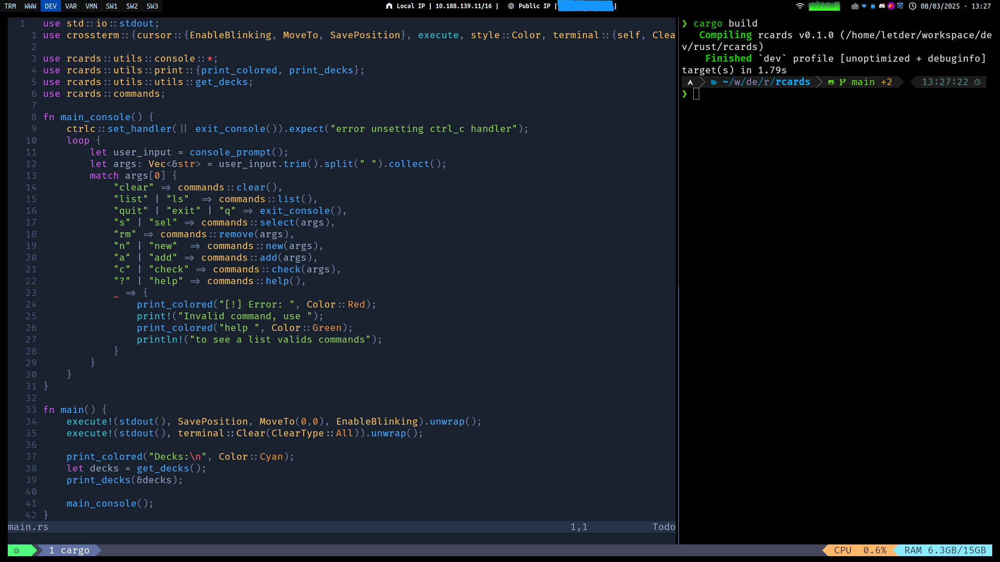
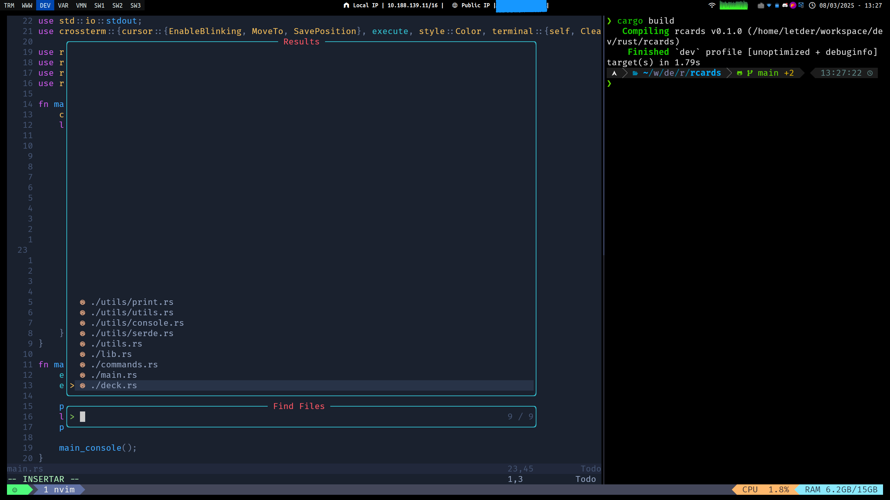

# Letder's Neovim config
My custom neovim config

## Features 

**Some features**:
+ Packer
+ Mason
+ lspzero + lspconfig + mason-lspconfig
+ xray navigator
+ Telescope
+ Primeagen's harpoon
+ etc...

## Demo
**I use a custom tmux keybind for the terminal on the right side, check [dotfiles](https://github.com/Letder40/Dotfiles)**

